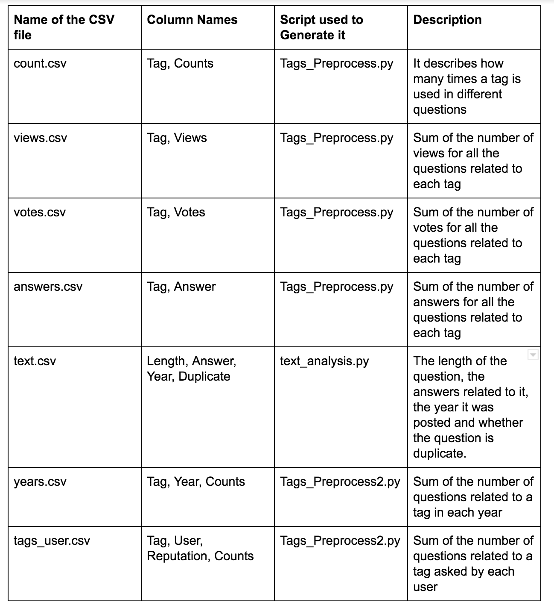

---
title: "Analysis of Stack Overflow Data"
output:
  html_document:
    df_print: paged
    toc: true
---
```{r setup, include=FALSE , fig.width= 30, }
knitr::opts_chunk$set(message = FALSE,
                      warning = FALSE)

```

## Introduction

*"How to convert a factor to integer/numeric without loss of information?"* *“Why is RStudio crashing?”*

Answers to most of the questions that we encounter (especially during assignments and projects like this one) can be found on StackOverflow. StackOverflow is everyone’s go-to for technical whys and hows. 

We intend to analyze the data from this platform to understand the topics around which questions are posted, trend of these topics across the years and a set of other questions that have been listed out in detail in the following sections.

In addition to these, we have two interactive plots:

* [Top 10 tags in 2010](https://s3.amazonaws.com/edavstackoverflow/2010.html)
* [Top 10 tags in 2018](https://s3.amazonaws.com/edavstackoverflow/2018.html)

The github repo for the project is : https://github.com/LisaThomas9/EDAV_StackOverflow

### Questions of Interest

1. **Time**

* How do the number of posts vary over the years?
* Monthly distribution of posts over the years
* How does views on a post vary with the age of a post ?
* How do the number of answers on questions vary over the years?
* How do the number of views vary over the years?
* How do the number of votes vary over the years?


2. **Tags**

* What tags appear most frequently with the tag "R"?
* Variation of Tags over the years
* Which are the most viewed tags?
* Which tags are most upvoted?
* Which tags are answered by reputed users?
* Which tags have received more answers?
* Which tags have not been answered but have posts regarding them?
* Which tags have not been answered but are viewed a lot?


3. **Users**
* Which tags are answered by reputed users?

* Does the number of votes a question receives impact the user reputation ?


4. **Text Analysis**
 
* How many questions are marked duplicate?
* Has there been a variation of length of the questions over the years?
* How many words do people generally use to pose a question?
* Do more elaborate questions receive more answers?


### Team Members and Contributions

1. Akanksha Rajput - ar3879
  Performed the Time based analysis on the data,  plotted the graphs of views, votes, answers    and questions on the basis of  years and top 10 tags., and assisted with executive summary and compilation of report.

2. Gurkanwar Singh - gs3006
Contributed to the preprocessing of data, analysis of top tags by year, by top reputed users and by average votes, compilation of report and Executive Summary
    
3. K Sheetal Reddy - kr2793
   Performed the text analysis on the data, implemented the python scripts for pre-processing of data for text analysis and tag analysis, assisted with the Executive summary and compilation of report.


4. Lisa Thomas - lt2709
Implemented the python-selenium-based scraper code to obtain the dataset. Generated the word cloud for the tags based on the frequency of appearance in questions and worked on the interactive component of the project. Assisted in compilation of report and executive summary.


## Description of the Data

The data was collected using a web scraper written by us in Python. The scraper goes through all the posts in a page, picks out the information of interest and progressively moves to the next page through a click event. The code can be found at stackoverflow_scrape.py. 

Given the sheer volume of questions on Stack Overflow (17,000,000 to date) and the size of the Data Dump (70 GB) we decided to focus on a subset of questions.
We chose to subset the data on questions related to the tag "R". This brought down our data set to roughly 260000 rows.
Each row in this dataset represents a question posed on Stack Overflow. 
The dataset comprises of all posts related to “R”  since the inception of the tag back in July 2009 until 17th November 2018.

The dataset is a csv file which has the following features. 


**Features**: 
The dataset has  263,145 rows and 9 columns (32 MB). The columns cover the following key aspects of each post:

* Question
* Vote_Count
* View_Count
* Ans_Count
* Tags
* Date_Posted
* Time_Posted
* User
* Reputation


A question is likely to be associated with multiple tags. Due to this unstructured format, we decided to group all the tags into a single column named "Tag" . We preferred this format over the tidy version as the number of tags per question is not fixed and would result in extensive duplication of existing data. The chosen representation requires further data preprocessing in order to be able to create graphs in R.

New datasets with processed data:


Below are the CSV files created during pre-processing of web-scraped data . All of them are used to extract different information versus tags in the questions

```{r, out.width = "600px"}



```


```{r}
library(ggplot2)
library(tidyr)
library(ggthemr)
library(dplyr)
ggthemr("solarized")
Stack <- read.csv(file="Clean_data.csv",sep=",")
```

```{r}
summary(Stack$Vote_Count)
```

We see negative numbers in the Vote_count as this is an aggregate of the number of upvotes and downvotes. If a post has more number of downvotes than upvotes, the Vote_Count will have a negative value. 

```{r}

summary(Stack$View_Count)
```
```{r}
summary(Stack$Ans_Count)
```
```{r}

summary(Stack$Reputation)
```

## Analysis of Data Quality

We started with the analysis of missing values across the variables. 
The first step was to use the `visna` function in the `extracat` package to determine missing patterns in the dataset.

```{r}

library(extracat)
visna(Stack, sort = "b")

```

We notice only 2 patterns in the dataset :

* No missing values.
* Only User missing

The graph shows that only a very small percentage of the rows seem to have a missing User.  
While scraping the data,we encountered a few Users who had deactivated their account. Due to absence of user information in such scenarios, we explicitly set the username to NA

The dataset needed cleaning in the values that were read in as numeric quantities. Features such as View_Count and Reputation, are presented in an easy-to-read format, so 1234 would be represented as 1,234 and large values such as 12300 are condensed to 12.3k.

A python script Process_Data.py was used to clean the data on these numeric columns and to ensure that all the data is in a format that can be processed by R. The script takes the original csv as input and generates Clean_data.csv that has data in the correct numeric format.

## Main analysis (Exploratory Data Analysis)

### Time


#### How do the number of posts vary over the years?
```{r}
MyData <- read.csv(file="Clean_data.csv", sep=",")
dfv<-MyData
dfv$Date_Posted <- as.Date(dfv$Date_Posted, "%d/%m/%Y")

dfv[, "Year"] <- format(dfv[,"Date_Posted"], format="%Y")

line_df <- dfv %>% group_by(Date_Posted) %>% summarise(n = n())

df_facet<-line_df%>%
  mutate(year = as.numeric(format(Date_Posted, "%Y")), month = format(Date_Posted, "%m")) 

ggplot(df_facet, aes(Date_Posted, n)) + 
  geom_line( )+ geom_smooth( ) + labs(y="Number of Questions", x = "Date")
```

Number of the questions increased significantly over the years. It implies that the popularity of stackoverflow is continuously increasing, and the people are asking more questions for their issues/queries  on stackoverflow.


#### Monthly distribution of posts over the years
```{r}
df<-MyData
df$Date_Posted<- as.Date(df$Date_Posted, "%d/%m/%Y")

df_facet<-df %>%
  mutate(month = format(Date_Posted, "%m"), year = format(Date_Posted, "%Y")) %>%
  group_by(month, year) %>%
  summarise(total = n())

y1 <- ggplot(df_facet, aes(x=month, y=total)) + geom_bar(stat="identity", fill = "#0d6ca6")+ facet_grid(year ~ .) +ggtitle("Number of Questions over the Months") + labs(y="Number of Questions", x = "Months")
y1

```

As we see that over the years, the number of questions is increasing. An interesting insight is that the people ask less questions in specific months (December and January) which are constant over the years. A possible reason for this is that these months have holidays and fewer people do programming during these months.


#### How does views on a post vary with the age of a post ?
```{r}

MyData$diff <- as.integer((as.Date("10/12/18", format="%d/%m/%y") - as.Date(MyData$Date_Posted, format="%d/%m/%Y"))/30)

tb2 <- MyData %>% filter(diff < 500)
ggplot(tb2, aes(x=diff,y=View_Count)) +
  geom_point()


```

There is a clear area in the plot that shows that new posts have received fewer views. For some older posts, we can see that there is a high view count associated with them. But, for a majority of the older posts, the view count is low. A plausible explanation for this could be that those posts might be very specific in its details and there were not many users who have encountered a similar issue.


#### How do the number of answers on questions vary over the years?
```{r}
df<-MyData
df$Date_Posted <- as.Date(df$Date_Posted, "%d/%m/%Y")

df[, "Year"] <- format(df[,"Date_Posted"], format="%Y")

ggplot(df, aes(as.factor(Year), as.numeric(Ans_Count))) + 
  geom_boxplot( ) + 
  theme_light()+
  scale_x_discrete(name="Year")


```


It seems that the newer questions have fewer answers than the older ones, and the number of the answers on each question across the years are less than 5 except some questions , for instance- there are 4 questions which have more than 20 answers, and those were asked in earlier years-2009 and 2010


#### How do the number of views vary over the years?
```{r}

df<-MyData
df$Date_Posted <- as.Date(df$Date_Posted, "%d/%m/%Y")

df[, "Year"] <- format(df[,"Date_Posted"], format="%Y")
ggplot(df, aes(as.factor(Year), as.numeric(View_Count))) + 
  geom_boxplot( ) + 
  theme_light()+
  scale_x_discrete(name="Year")

```

Median number of the views for questions are lower in the recent years than previous years. By our analysis from other graphs, we know that the number of the questions posted per year are increasing, so we can conclude that due to longer duration, older posts have more views. Some posts have significantly higher number of views in comparison of the range. Assuming that there is no error in data collection, those questions probably are based on the issues/questions, which most of the people working in that field are likely to encounter, or the answer of the question is helpful to resolve user’s query.


#### How do the number of votes vary over the years?
```{r}
df$Date_Posted <- as.Date(df$Date_Posted, "%d/%m/%Y")

df[, "Year"] <- format(df[,"Date_Posted"], format="%Y")

ggplot(df, aes(as.factor(Year), Vote_Count)) + 
  geom_boxplot( ) + 
  theme_light()+
  scale_x_discrete(name="Year")


df_outlier <- df %>% filter(df$Vote_Count<30)

ggplot(df_outlier, aes(as.factor(Year), Vote_Count)) + 
  geom_boxplot( ) + 
  theme_light()+
  scale_x_discrete(name="Year")


```

Number of the votes varies significantly from question to question. Hence, while plotting the boxplot, it shows so many votes_count for questions as outliers. 
Older posts seem to have more votes than the newer ones. Since boxplots are not visible due to the so-called outliers, we tried plotting another graph with the vote count less than 30. An interesting observation is  that there are negative upvotes (down votes) as well which were not visible before due to the wide range of votes. Assuming that the data does not contain any errors, many people found 2 of the questions in 2014 very helpful. Though it was plotted in 2014, the number of upvotes for these questions are likely to be more than the upvotes of previous years (though this may not be applicable to all questions).

### Tags

#### What tags appear most frequently with the tag "R"?


To analyze how frequently tags appear, we use Tags_preprocess.py to generate a Tagstring which is the input to word_cloud.py which generates the above word cloud.
We notice terms such as ggplot2 , dataframe, dplyr and shiny stand out.


#### Which tags have received more answers?
```{r}
MyData1 <- read.csv(file="answers.csv", sep=",")
Countdata<- read.csv(file="counts.csv", sep=",")
Viewdata<- read.csv(file="Views.csv", sep=",")


df1<-MyData1[order(MyData1$Answers, decreasing = TRUE),]
df1<-df1[1:10,]


y1 <- ggplot(df1, aes(x=reorder(Tag,-Answers), y=Answers)) + geom_bar(stat="identity", fill = "#0d6ca6")
y1
```

As we know, ggplot2 has been highly used in recent years as it is convenient to write the code of ggplot2 than of Base R . Number of the answers related to ggplot2, asked over the years on stack overflow are much higher than other tags which have  existed even before ggplot2. It clearly shows an increasing trend in the use of ggplot2. Even though dplyr and ggplot2 came out around the same time there is a significant difference in number of the answers. One possible explanation can be that it is more likely that people add ggplot2 with dplyr often . However, reverse is not always true.
It is obvious to have more answers on data frame, as most of the data is imported in the form of the data frame, and it is there in Base R too.


#### Which are the most upvoted tags?
```{r}
MyData1<- read.csv(file="votes.csv", sep=",")


df1<-MyData1[order(MyData1$Votes, decreasing = TRUE),]
df1<-df1[1:10,]

y1 <- ggplot(df1, aes(x=reorder(Tag,-Votes), y=Votes)) + geom_bar(stat="identity", fill = "#0d6ca6") + theme(axis.text =element_text(angle=25, hjust = 1))+
  ggtitle("Number of Votes on the Top 10 Tags") + labs(y="Number of Votes", x = "Tags")

y1
```

As we noticed in the graph relating the tags to the answers, number of the questions related to ggplot2 and data frame are much higher than the rest of the tags, hence it is more likely that the total upvotes are more.


#### Which are the most viewed tags?
```{r}
MyData1<- read.csv(file="views.csv", sep=",")
Countdata<- read.csv(file="counts.csv", sep=",")

MyData1$Views<- as.numeric(MyData1$Views)
df1<-MyData1[order(MyData1$Views, decreasing = TRUE),]

df1<-df1[1:10,]


y1 <- ggplot(df1, aes(x=reorder(Tag,-Views), y=Views)) + geom_bar(stat="identity", fill = "#0d6ca6") + theme(axis.text =element_text(angle=25, hjust = 1))+
  ggtitle("Number of Views on the Top 10 Tags") + labs(y="Number of Views", x = "Tags")

y1
```

Similar to the graph pertaining to tags and votes, number of the views are significantly higher for the top 2 tags. If we compare the votes and views for the top tags , views are much more in number than votes, showing hoe people are more likely to view a question and not leave a vote.


#### Which tags have not been answered but have posts regarding them?
```{r }
MyData1<- read.csv(file="answers.csv", sep=",")
df2<-MyData1 %>% filter(MyData1$Answers== 0) 
#View(df2)
df3<- Countdata %>% filter(Countdata$Tag %in% df2$Tag) %>% filter(Counts > 1)

df3<-df3[1:20,]
z1 <- ggplot(df3, aes(x=reorder(Tag,-Counts), y=Counts)) + geom_bar(stat="identity", fill = "#0d6ca6") + ggtitle("Tags with no Answers versus Number of the Questions") + labs(y="Number of Questions", x = "Tags with no Answers") + theme(axis.text =element_text(angle=25, hjust = 1))
z1

```

We tried finding out questions which do not have any answers, and analyze which tags are used for these questions. As we see, dimension (dlm tag used) has highest number of questions which are not answered by anyone. We also found out that the number of such questions are not very high.


#### Which tags have not been answered but are viewed a lot?
```{r }
df3<- Viewdata %>% filter(Viewdata$Tag %in% df2$Tag) %>% filter(Views > 1)

df3<-df3[1:20,]
z11 <- ggplot(df3, aes(x=reorder(Tag,-Views), y=Views)) + geom_bar(stat="identity", fill = "#0d6ca6") + ggtitle("Tags with no Answers versus Number of the Views") + labs(y="Number of Views", x = "Tags with no Answers") + theme(axis.text =element_text(angle=25, hjust = 1))
z11

```

As we know that number of the questions with no answers are high for dim tag in comparison of other tag, but the number of views are proportionally much higher for dim tag than for other tags. All other tags for such questions have less than 300 views , while questions related to dim tag have more than 2000 views.This shows that there are some tags which might not have a lot of questions, but the questions that are present are viewed by a lot of people. 
Having an idea of such largely viewed tags with no answers, would be a good resource for stack overflow to know where the gaps in their website are.


#### Variation of Tags over the years
```{r  fig.width=20, fig.height=20}

top_tags <- read.csv("years.csv")


top_tags <- top_tags %>%
  group_by(Year) %>%
  arrange(Year, -Counts)%>%
  top_n(10) %>%
  ungroup %>%
  arrange(Year, Counts) %>%
  mutate(.r = row_number()) 
  
  
ggplot(top_tags, aes(.r, Counts))+
  geom_col(show.legend=FALSE) +
  facet_wrap(~Year, scales= 'free')+
  scale_x_continuous(  # This handles replacement of .r for x
    breaks = top_tags$.r,     # notice need to reuse data frame
    labels = top_tags$Tag
  ) + 
  coord_flip()+ theme_grey(21)
  ggtitle("Top 10 Tags by Year")

```
As can be seen from the above plots, while ‘statistics’ was the tag related to most questions asked at the inception of Stack Overflow in 2009, it quickly got dethroned by ‘ggplot2’ the next year, which has held its spot as the most popular tag to ask question on in Stack Overflow since then. Questions related to ‘dplyr’ package have been on the rise since 2015, and questions related to ‘r-markdown’ have surged in popularity since its introduction in 2017.

### User

#### Which tags are answered by reputed users?

```{r fig.width=20, fig.height=20}
data1 <- read.csv("tags_user.csv")
data1$Reputation <- as.numeric(data1$Reputation)

data2 <- data1 %>% select(User, Reputation) %>% distinct() %>% 
  arrange(-Reputation) %>% head(10)


data3 <- data1 %>%
  arrange(-Reputation,-Counts) %>%
  filter(User %in% data2$User, Reputation %in% data2$Reputation)


data4 <- data3 %>%
  group_by(User, Reputation) %>% 
  arrange(Reputation, User, -Counts)%>%
  top_n(5) %>%
  ungroup %>%
  arrange(-Reputation, User, Counts) %>%
  mutate(.r = row_number()) 


ggplot(data4, aes(.r, Counts))+
  geom_col(show.legend=FALSE) +
  facet_wrap(~Reputation + User, scales= 'free')+
  scale_x_continuous(  # This handles replacement of .r for x
    breaks = data4$.r,     # notice need to reuse data frame
    labels = data4$Tag
  ) +
  coord_flip()+ theme_grey(21)
  ggtitle("Top 10 Tags by User Reputation")


```

Reputation on Stack Overflow is earned when a user post good questions and answers and gets upvoted. When a question is upvoted, the user gains 5 points and when it is downvoted, the user loses 2 points of Reputation. The chart reveals that most of the top users with the highest reputation have asked questions related to ‘ggplot2’. Some other common topics include ‘dplyr’ and ‘plot’. Other topics are very diverse.

#### Does the number of votes a question receives impact the user reputation ?
```{r}
tb1 <- MyData %>% group_by(User, Reputation) %>% summarise(vcount=sum(Vote_Count)) %>%  filter(vcount < 3000 & Reputation < 50000 )

ggplot(tb1, aes(x=vcount,y=Reputation)) +
  geom_point()
```

We can observe that users who have received high votes have high reputation. At the lower end of vote count, we can see multiple levels of reputation score associated with low votes. Users having high reputation but received low votes for their questions might have built their reputation from posting/answering questions in domains other than R. Users having low vote count and low reputation score might be representative of infrequent users.


### Text Analysis

#### How many questions are marked duplicate?
```{r}

Text <- read.csv(file="text.csv",sep=",")
Text$Year <- factor(Text$Year)
Years <-  as.data.frame(Text %>% group_by(Year, Dup) %>% summarise(counts = length(Year)))
ggplot(data=Years, aes(Year,counts)) +  geom_bar(stat="identity", aes(fill=Dup))

Years2 <-  as.data.frame(Text %>% group_by(Year) %>% summarise(counts = sum(Dup=="Duplicate")/n()*100))
ggplot(data=Years2, aes(Year,counts)) +  geom_bar(stat="identity")


```


To analyze how many questions on stack overflow are redundant, we looked at the text of the question The text is usually marked with a tag [Duplicate] to indicate that it is a copy of an existing question. 
The script text_analysis.py was used to analyze the text of the question and create Text.csv that has a field Dup to indicates duplicates.

We see a steady rise in the number of duplicates over the years, which is expected as the number of questions have increased over the years.
We also notice an increase in the percentage of duplicates compared to the new ones which is expected since, as the years go by a question asked might have already been asked before.


#### Has there been a variation in the length of the question over the years?

```{r}
Text$Year <- factor(Text$Year)
Box <- ggplot(Text, aes(x = Year, y = Length)) +
  geom_boxplot() 
Box
```


There is no clear distinction in the length of the question over the years. An interesting find is that for every year there seems to be a number outliers beyond the upper fence. This would mean each year seems to have questions that are much longer than the median length.

#### How many words to people generally use to pose a question?
```{r}

Bins <- as.data.frame(Text %>% group_by(Length) %>% summarise(counts = length(Length)))
ggplot(data=Bins, aes(Length,counts)) +  geom_bar(stat="identity")
```

We see that this almost follows a normal distribution that peaks at 8-9 words but is slightly right skewed. Questions such as "How to sort a dataframe by multiple column(s)?" is a typical example of how a question can briefly but completely described within 8 words.

#### Do more elaborate questions receive more answers?
```{r}
Answers <- as.data.frame(Text %>% group_by(Length) %>% summarise(counts = sum(Answer)))
Answers$counts = Answers$counts / Bins$counts
ggplot(data=Answers, aes(Length,counts)) +  geom_bar(stat="identity")

```

We see that the length of the question generally does not impact the average number of answers received but there seems to be a spike towards the far end of questions greater than 30 words. Showing that the length does not have an impact unless it is very long.


## Executive summary

### Introduction

Stack Overflow is everyone’s go-to for technical questions related to programming. We decided to analyze the data from this platform to address the following questions:

* How has the number of questions varied over the years?
* What are the top topics over the years?
* Are there any gaps between the questions posted and the number of views or answers?

We web-scraped the pages of Stack Overflow to create a dataset with variables like Vote Count, View Count, Answer Count, Tags, Date and Time Posted, User and Reputation for each Question posted. Due to the large volume of data, we have focussed only on questions related to R.

### Insights from Data

#### How has the number of questions evolved over time?

```{r echo=FALSE}
df<-MyData
df$Date_Posted<- as.Date(df$Date_Posted, "%d/%m/%Y")

df_facet<-df %>%
  mutate(month = format(Date_Posted, "%m"), year = format(Date_Posted, "%Y")) %>%
  group_by(month, year) %>%
  summarise(total = n())

y1 <- ggplot(df_facet, aes(x=month, y=total)) + geom_bar(stat="identity", fill = "#0d6ca6")+ facet_grid(year ~ .) +ggtitle("Number of Questions over the Months") + labs(y="Number of Questions", x = "Months")
y1

```

It is clear that the number of the questions has increased significantly over the years. It implies that the popularity of stackoverflow is continuously increasing, and the people are asking more questions for their issues/queries on Stack Overflow. From the monthly trend, it appears that the 
number of questions decreases slightly during the months of December and January every year. This may be because of winter holidays in these months, there is a drop in programming done by people in general.

#### Are there any tags with no answers but many views?

```{r echo=FALSE }

df3<- Viewdata %>% filter(Viewdata$Tag %in% df2$Tag) %>% filter(Views > 1)

df3<-df3[1:20,]
z11 <- ggplot(df3, aes(x=reorder(Tag,-Views), y=Views)) + geom_bar(stat="identity", fill = "#0d6ca6") + ggtitle("Tags with no Answers versus Number of Views") + labs(y="Number of Views", x = "Tags with no Answers") + theme(axis.text =element_text(angle=25, hjust = 1))
z11

```

The graph reveals that there are some tags with high number of the questions but no answers, and for which the number of views are proportionally much higher than  other tags. For example, the tag ‘dim’ above. Having an idea of such largely viewed tags with no answers, would be a good resource for stack overflow to know where the gaps in their website are. They can redirect such questions to users who are expert in those topics (users who have answered highly upvoted questions related to those tags). 

#### What are the top tags over the years?

```{r echo=FALSE, fig.width = 20 , fig.height = 20}
top_tags <- read.csv("years.csv")


top_tags <- top_tags %>%
  group_by(Year) %>%
  arrange(Year, -Counts)%>%
  top_n(10) %>%
  ungroup %>%
  arrange(Year, Counts) %>%
  mutate(.r = row_number()) 
  
  
ggplot(top_tags, aes(.r, Counts))+
  geom_col(show.legend=FALSE) +
  facet_wrap(~Year, scales= 'free')+
  scale_x_continuous(  # This handles replacement of .r for x
    breaks = top_tags$.r,     # notice need to reuse data frame
    labels = top_tags$Tag
  ) +
  coord_flip()+ theme_grey(21) + 
  ggtitle("Top 10 Tags by Year")

```

The chart shows that ‘ggplot2’, ‘dplyr’, ‘shiny’ ,’dataframe’ etc. are the most popular topics that people have posted questions on. Tags like ‘sweave’ have gradually fallen out of popularity and taken over by tags like ‘r-markdown’.

#### How many questions are repeated over time?

```{r echo=FALSE}
Text <- read.csv(file="text.csv",sep=",")
Text$Year <- factor(Text$Year)

ggplot(data=Years2, aes(Year,counts)) +  geom_bar(stat="identity")  + 
 ggtitle("Percentage of duplicate questions over the years") +
 labs(x="Year", y="Percentage of Duplicate Questions")

```

We noticed that there is an increasing trend in duplicated questions posted over the years and we also know that the most popular tags have remained the same, so we anticipate that there will be many duplicate questions with popular tags that can be redirected to the original question.

### Conclusion/Recommendations

* The number of questions posted on Stack Overflow has been drastically increasing, indicating its rising popularity 
* Topics like ‘ggplot2’, ‘dplyr’, ‘shiny’, ‘dataframe’ have been consistently popular over the years
* The site moderators can redirect questions with no answers but high views/votes and popular tags to expert users in those tags to reduce the gap between the demand and supply of important information
* As soon as a question is assigned ‘Duplicate’ tag, add a link to redirect the users to the original question

## Interactive component

Interactive plots:

* [Top 10 tags in 2010](https://s3.amazonaws.com/edavstackoverflow/2010.html)
For this plot, we extracted the top 10 tags from the questions posted in 2010. Keeping these tags a constant across the years, the plot shows the trend in these topics, that is, if the questions around these topics have increased/decreased

* [Top 10 tags in 2018](https://s3.amazonaws.com/edavstackoverflow/2018.html)
Similar to the above plot, we picked the top 10 tags in 2018 and observed its trend from 2010 to 2018.


Using the interactive component, we want to observe the trends in tags/topics across the years. 
How frequently are the tags prominent in 2010 still being used in questions in 2018?  We could see a clear increase in the questions related to ggplot since 2010. This coincides with the timeframe when ggplot was released. A natural hypothesis for this trend could be that more users started using ggplot and hence questions around ggplot increased.  Another interesting trend that we observed was with respect to the sweave tag. This topic practically disappeared 
over the years. With a little background check, we found that sweave is used to generate LaTex based pdf reports. It is fully supported by RStudio. The possible explanation for the decline in the number of questions about sweave could be people tagging the questions with just RStudio or the rising popularity of RMarkdown to generate reports.

Another perspective the interactive component provides is the growth in topics that are currently frequent. We could see a steady increase in the number of questions posted around these topics, in particular dplyr and shiny. As we had expected, the initial increase in such questions coincided with the year of their first release.

Reference: 
* https://bl.ocks.org/martinjc
* Interactive Data Visualization for the Web

### Future Scope

The plots currently statically use the top 10 tags towards the beginning of the dataset (2010) and then the tags from the end of the dataset (2018). What we would like to do, is to use keys to achieve object constancy and have the top tags in each year appear dynamically as the slider goes over the year, with tags that were present in the previous year either shifting to their new positions or disappearing off the graph and new tags appearing in.

## Conclusion

* With more time at hand, we want to obtain the answers data for the questions in our dataset and analyze the users answering the questions.
One interesting question we would like to work on is to identify the intersection of domains of expertise of such users.

* We also want to compute the average response time to questions based on the tags. This would provide users an estimate of the time interval in which they might receive an answer to their posts.

* Further, using the answers data in conjunction with the questions data, we want to observe the correlation between user’s reputation score, questions asked and answers given, if any exists.


